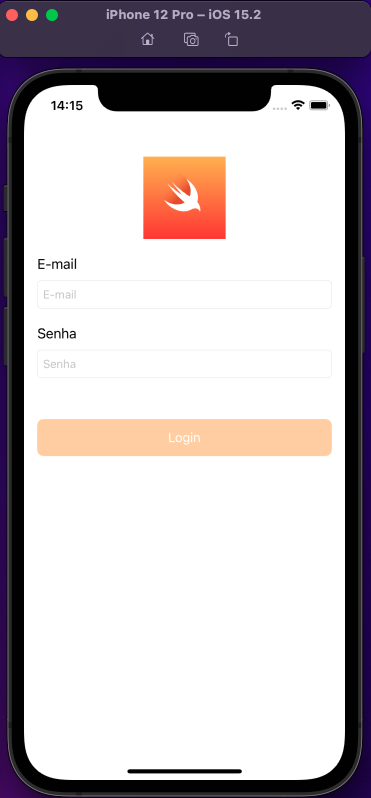

# Tela Login

\
Desafio Login, programa go!dev by idwall, onde o objetivo é desenvolver uma tela de login, que tenha validação de e-mail e senha
\
A tela só habilita a botão de login quando o usuário digita o e-mail válido e uma senha, quando o usuário clica no botão login, é exibido um alerta na tela falando que o o usuário foi logado com sucesso.
\
Foi usado um regex de e-mail para fazer a validação
\
Foi utilizado para desenvolver essa tela o Storeboard, UIKit e o xcode 13.2.1
